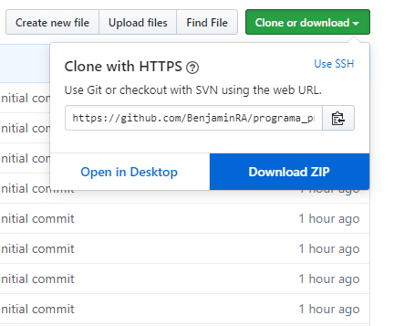
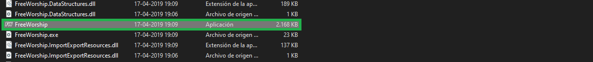
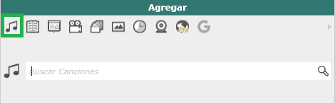

# FreeWorship
En este documento explicaremos el proceso de instalación y de uso del software **FreeWorship** para la proyección de cánticos y de la Biblia RVR1960
- [Instalación](#instalación)
- [Instrucciones de uso](#Instrucciones-de-uso)
    - [Buscar coros/himnos](#Buscar-coros/himnos)
    - [Buscar versículos](#Buscar-versículos)
    - [Agregar canciones](#Buscar-Himnos)
    - [Editar canciones](#Buscar-Himnos)
    - [Edición rápida](#Buscar-Himnos)

## Instalación
Para descargar debe hacer click en el botón verde que dice `Clone or download` y luego en `Download ZIP`, tal como muestra la siguiente imagen.

Luego de eso, hay que descomprimir el archivo descargado en el lugar donde desea instalar el programa. Como es un software portable, solo es necesario tener los archivos y no requiere de un proceso de instalación que modifique los registros, entre otras cosas.

Finalmente, para iniciar el programa debe hacer doble click en el ícono que dice `FreeWorship`

En caso de que aparezca un cuadro de dialogo diciengo algo de un registro, es una cosa opcional, puede llenar ese formulario o cerrarlo directamente y el programa abirirá normalmente.

## Instrucciones de uso
### Buscar coros/himnos
El programa inicia por defecto en modo "buscar canciones", pero para entrar a ese modo hay que hacer click en el ícono de la nota musical, ubicado en el menu de modos de la puarte superior izquierda del programa

Para buscar algún coro o himno, debemos escribir parte del título en la barra de busqueda. 

Los himnos se pueden buscar tanto por número como por título. **Es importante destacar** que cuando buscamos por número, debemos colocar los 3 dígitos incluyendo los ceros a la izquierda. Por ejemplo:

- Para buscar el himno número `5` ponemos `005` en el buscador.
- Para buscar el himno número `29` ponemos `029` en el buscador.
- Para buscar el himno número `385` ponemos `385` en el buscador.

Luego de encontrar la alabanza que queremos proyectar, la podemos seleccionar de dos formas.

- Haciendo `doble click` en el Coro/Himno encontrado.
- Presionando `Flecha Abajo` (Para interactuar con los resultados de la busqueda) y luego `Enter`. Esta forma es la que considero más rápida, ya que en ningún momento sacamos las manos del teclado.

