# FreeWorship
En este documento explicaremos el proceso de instalación y de uso del software **FreeWorship** para la proyección de cánticos y de la Biblia RVR1960.
- [Instalación](#instalación)
- [Instrucciones de uso](#Instrucciones-de-uso)
    - [Proyección](#proyección)
    - [Buscar Coros/Himnos](#Buscar-coros/himnos)
    - [Buscar versículos](#Buscar-versículos)
    - [Agregar canciones](#Agregar-canciones)
    - [Editar canciones](#Editar-canciones)
    - [Edición rápida](#Edición-rápida)

## Instalación
Descargar el programa desde el siguiente enlace: https://drive.google.com/file/d/1bCXi3mm60l7iShWg_oirCZeVdT97TGDN/view?usp=sharing

Luego de eso, hay que descomprimir el archivo descargado en el lugar donde desea instalar el programa. Como es un software portable, solo es necesario tener los archivos y no requiere de un proceso de instalación que modifique los registros.

Finalmente, para iniciar el programa debe hacer `Doble Click` en el ícono que dice `FreeWorship`

Al abrir la primera vez, le aparecera el siguiente cuadro de diálogo.

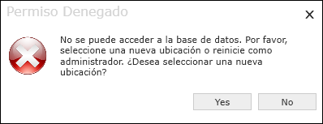

Debe seleccionar `Yes` y después en el buscador, hay que seleccionar la carpeta `Data` que se encuentra en la carpeta donde descomprimimos el programa.

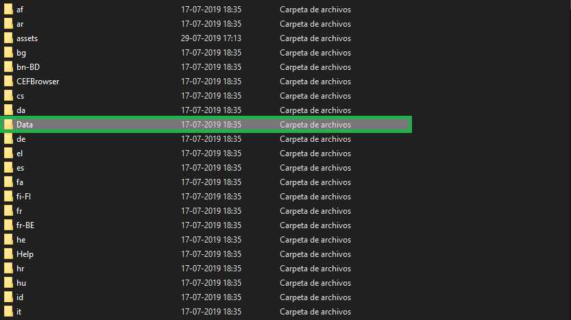

En caso de que aparezca un cuadro de dialogo diciengo algo de un registro, es una cosa opcional, puede llenar ese formulario o cerrarlo directamente y el programa abirirá normalmente.

## Instrucciones de uso
### Proyección
Veremos 3 funciones importantes a la hora de proyectar.

- Mostrar Contenido: presionando el cuarto botón de la barra de botones ubicada en la parte centro derecha o con la tecla `F12`. Sirve para volver a mostrar el contenido de lo que queremos proyectar cuando cambiamos a pantalla negra u ocultar contenido.

- Ocultar Contenido: presionando el tercer botón de la barra de botones ubicada en la parte centro derecha o con la tecla `F11`. Se ocupa para ocultar las letras o cualquier cosa que este mostrandose en pantalla, pero mateniendo el fondo.

- Mostrar Pantalla Negra: presionando el primer botón de la barra de botones ubicada en la parte centro derecha o con la tecla `F9`. Como su nombre lo dice, muestra una capa negra que cubre toda el área de la proyección.
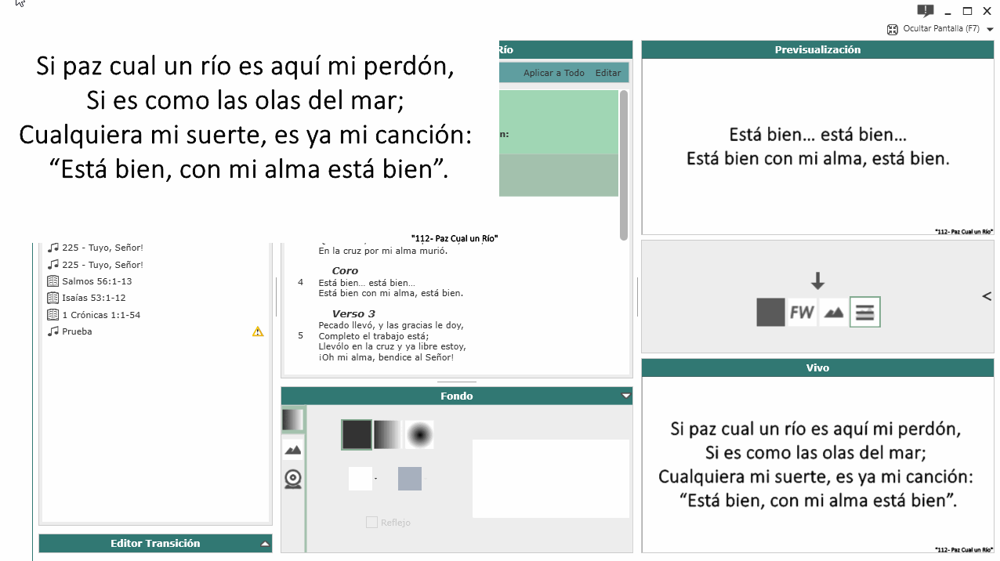

- Mostrar/Ocultar Pantalla: presionando el botón ubicado en la parte superior derecha o con la tecla `F7`. A diferencia de el modo Pantalla negra, esto oculta completamente el área de trabajo del programa y se muestra cualquier cosa que este abierta en el fondo. Por ejemplo, el escritorio con los íconos, el navegador, entre otras cosas.

### Buscar Coros/Himnos
El programa inicia por defecto en modo "buscar canciones", pero para entrar a ese modo hay que hacer click en el ícono de la nota musical, ubicado en el menu de modos de la parte superior izquierda del programa

Para buscar algún coro o himno, debemos escribir parte del título en la barra de busqueda. Si el titulo contiene algún acento, es necesario colocarlo, o no aparecerá en la coincidencias.

Los himnos se pueden buscar tanto por número como por título. **Es importante destacar** que cuando buscamos por número, debemos colocar los 3 dígitos incluyendo los ceros a la izquierda. Por ejemplo:

- Para buscar el himno número `5` ponemos `005` en el buscador.
- Para buscar el himno número `29` ponemos `029` en el buscador.
- Para buscar el himno número `385` ponemos `385` en el buscador.

Luego de encontrar el Coro/Himno que queremos proyectar, la podemos seleccionar de dos formas.

- Haciendo `Doble Click` en el Coro/Himno encontrado.
- Presionando `Flecha Abajo` (Para interactuar con los resultados de la busqueda) y luego `Enter`. Esta forma es la que considero más rápida, ya que en ningún momento sacamos las manos del teclado.

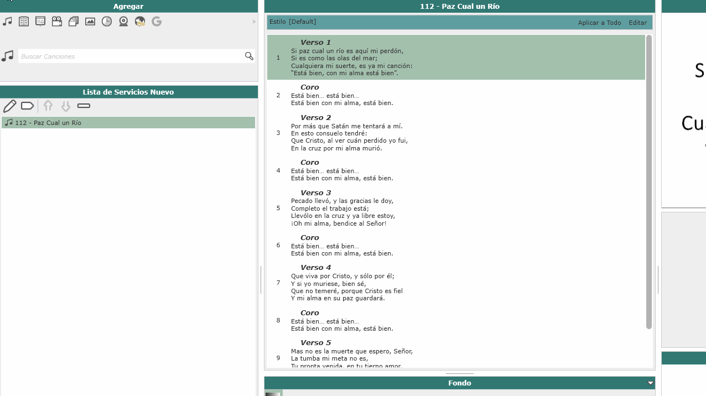

Cuando ya tenemos un Coro/Himno seleccionado, tendremos en pantalla todos los versos y coros que lo componen. Podremos mandar a la proyección en vivo un parrafo haciendole `Doble Click` o moviendonos con `Flecha Arriba/Flecha Abajo` y seleccionando con `Enter`

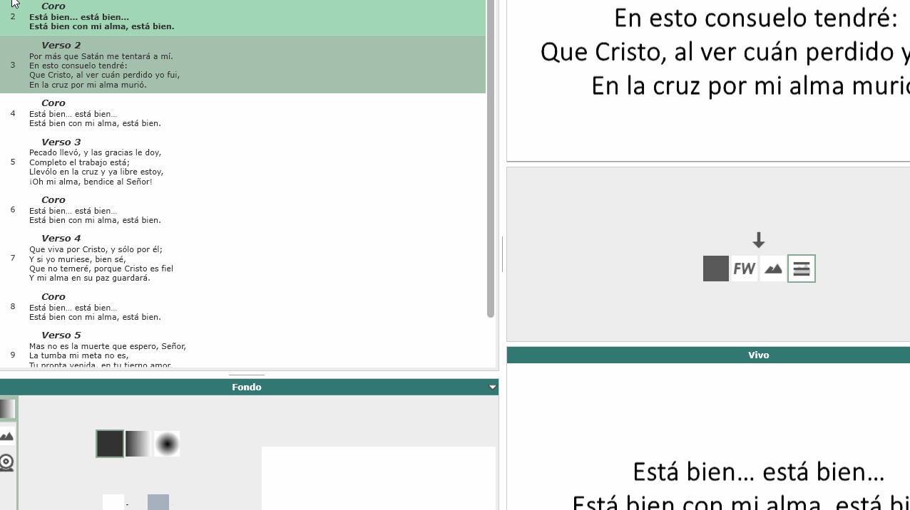

El cuadrado verde claro corresponde al parrafo que esta siendo proyectado actualmente.
El cuadrado verde oscuro es el parrafo que esta en selección para la vista previa y futura proyección.

### Buscar versículos

El modo de buscar versículos también en la barra de modos, y corresponde al ícono de la bíblia que aparece en la siguiente imagen.

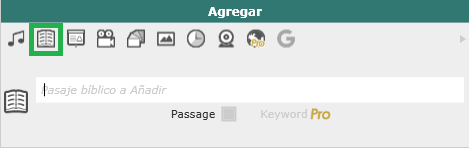

Vamos a desglosar la busqueda de versículos en tres partes: Libro, Capítulo, Versículo. Para movernos de un paso al siguiente lo haremos con las teclas `Espacio` o `Flecha Derecha`.

- Libro: Al momento de empezar a escribir en la barra de busqueda, el programa hara el trabajo de autocompletar con el libro de la bíblia que corresponda, o que coincida primero en orden alfabético.

- Capítulo: Sólo debemos escribir el número del capítulo que estamos buscando.

- Versículo: Podemos especificar un versículo en especifico, o un rango de versículos escribiendo un guion.

Luego, presionamos `Enter` para mostrarlo en la proyección.

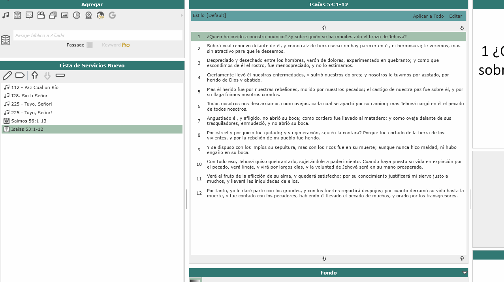

Al igual que con los Coros/Himnos, la porción que hayamos seleccionados, aparecera en pantalla. Tenemos tres modos de selección.

- 1 Versículo a la vez: Seleccionando con `Doble Click` o `Enter`

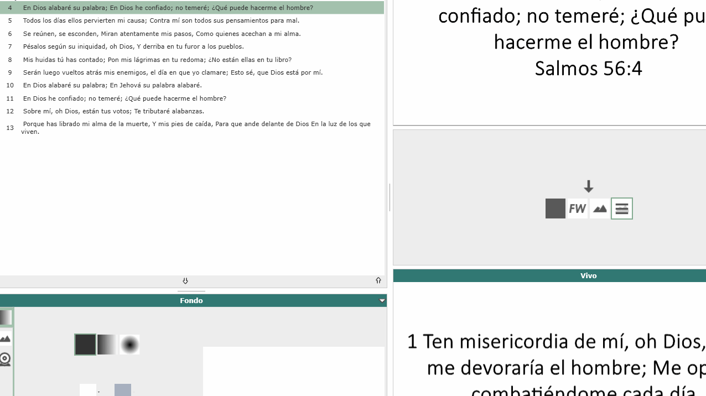

- Varios Versículos seguidos: Seleccionando con `Click + Shift` y luego `Enter`

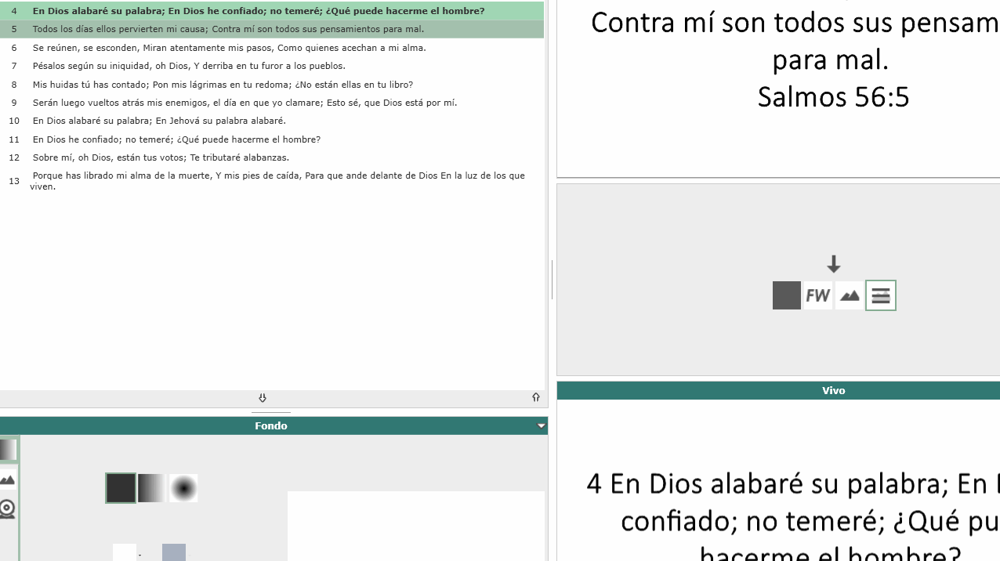

- Varios Versículos no necesariamente seguidos: Seleccionando con `Click + Ctrl` y luego `Enter`

### Agregar canciones

Nos vamos al menu de navegación ubicado en la parte superior izquierda, donde seleccionamos `Herramientas > Agregar canción`.
Aquí se mostrará un cuadro de diálogo donde escribimos toda la información necesaria del nuevo Coro/Himno.

- Versos: Escribimos la palabra `Verso`, el programa interpretara que se trata de un nuevo verso y colocara el número que corresponde.

- Coro: Escribimos la palabra `Coro`, el programa interpretara que se trata de un nuevo verso y colocara el número que corresponde.

- Repertir algún parrafo: Escribimos la palabra `Repeat` seguido de `Coro` o `Verso` y el número del Coro o Verso que queremos repetir. Ejemplo `Repeat Coro 1` o `Repeat Verso 3`.

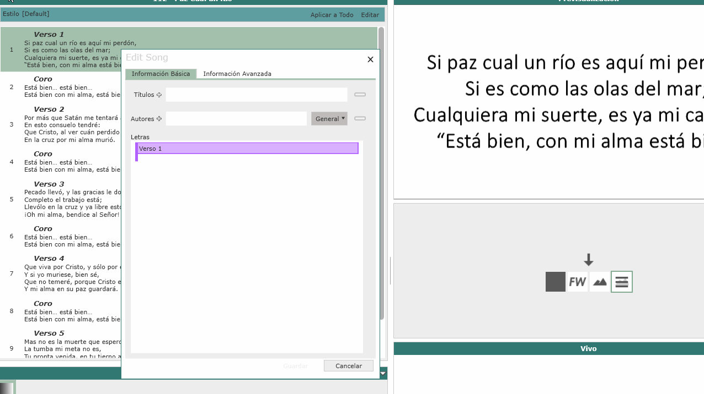

### Editar canciones
Nos vamos al menu de navegación ubicado en la parte superior izquierda, donde seleccionamos `Herramientas > Gestiona la Base de Datos`.
Aquí se mostrará un cuadro de diálogo con todos los Coros/Himnos que tenemos agregados. En el buscador escribimos el corito que queremos editar y le hacemos `Doble Click`. Aparerá el cuadro de dialogo de edición de canciones, y luego de hacer los cambios correspondientes, presionamos `Guardar`.

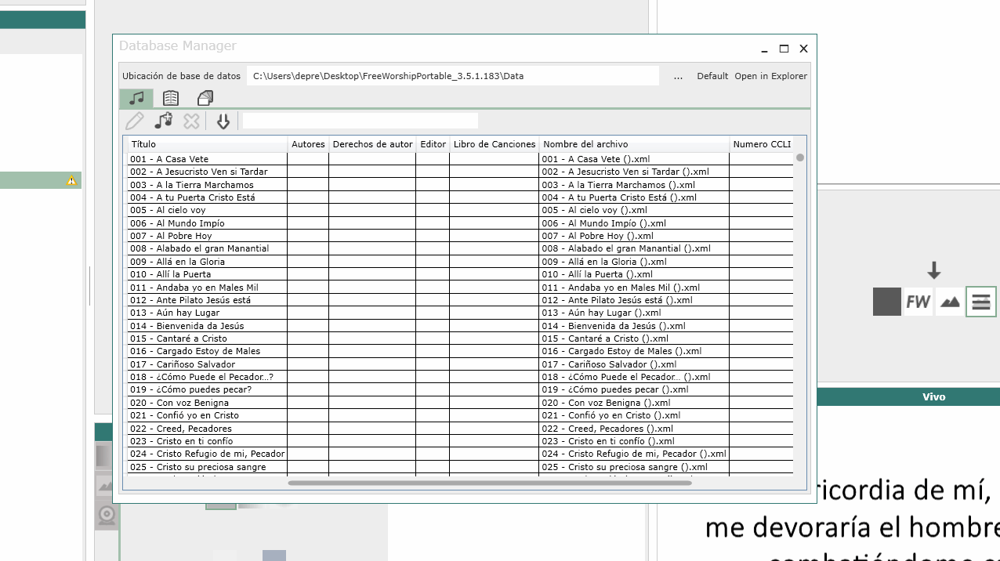

### Edición rápida
Estando en la previsualización del Coro/Himno, hacemos `Click Derecho` en el parrafo que queremos editar. Luego de hacer los cambios correspondientes hacemos `Click` en el recuadro verde, tal como muestra la siguiente figura.

